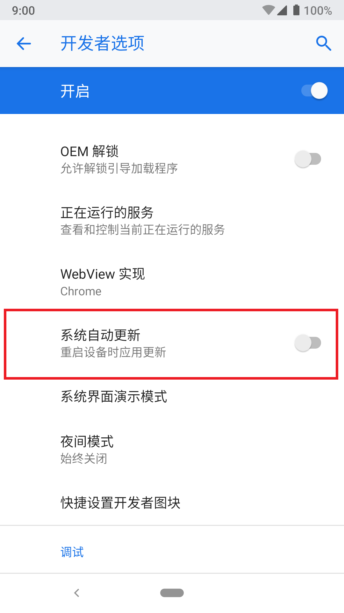
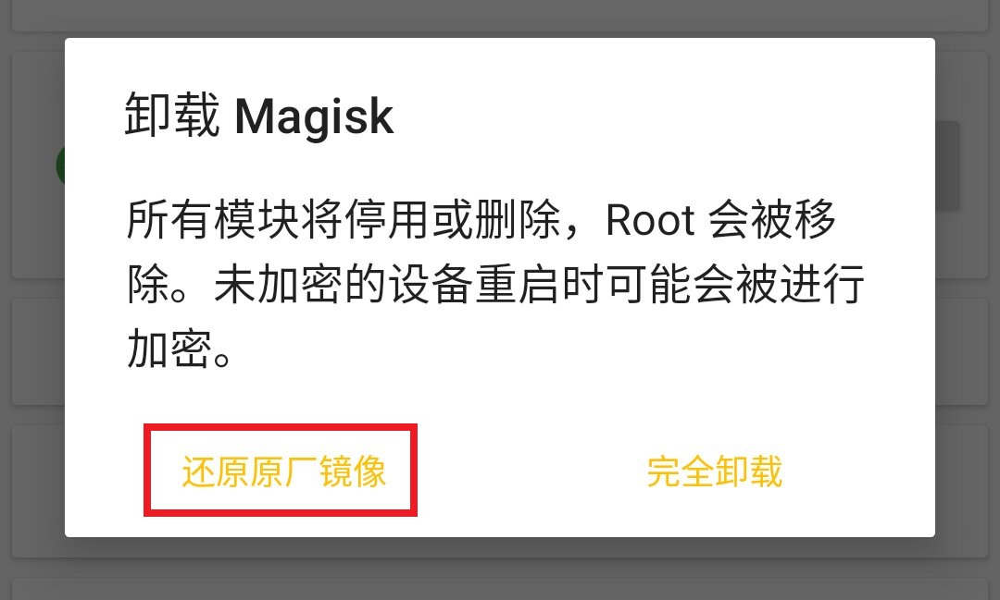
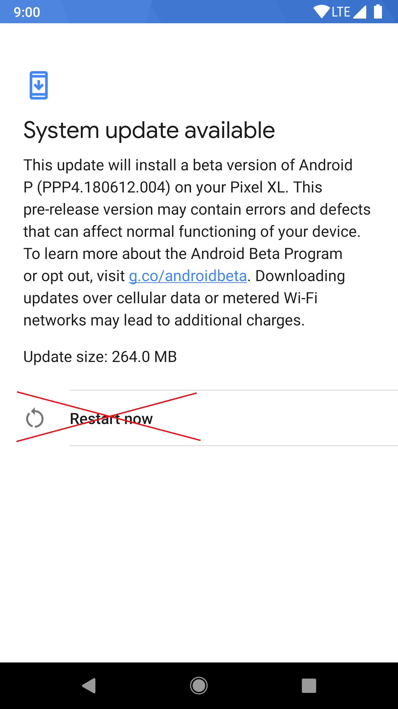
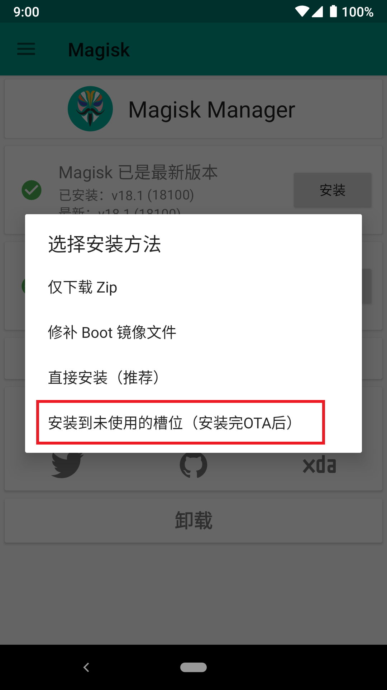
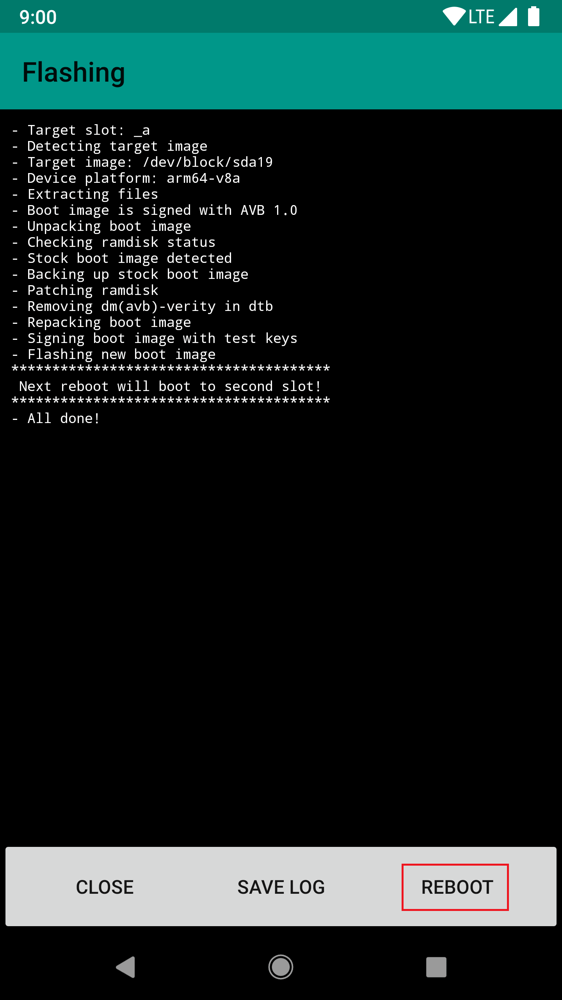
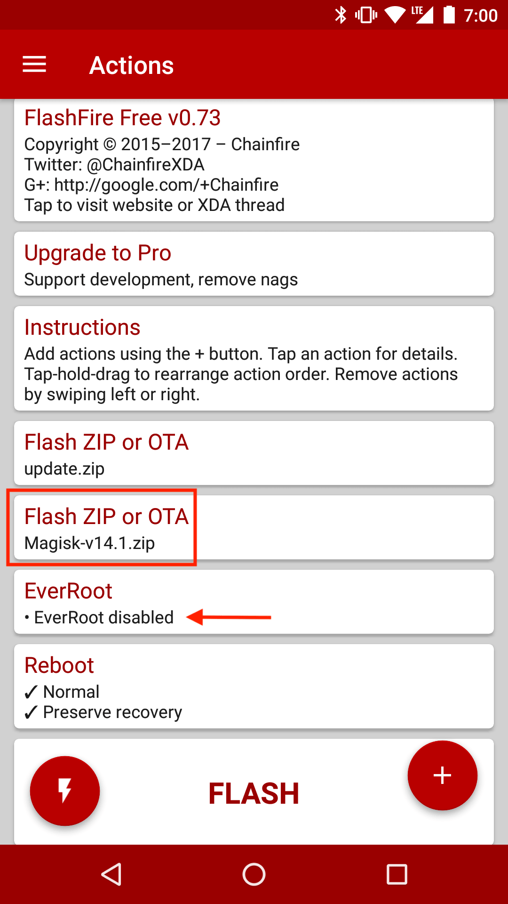
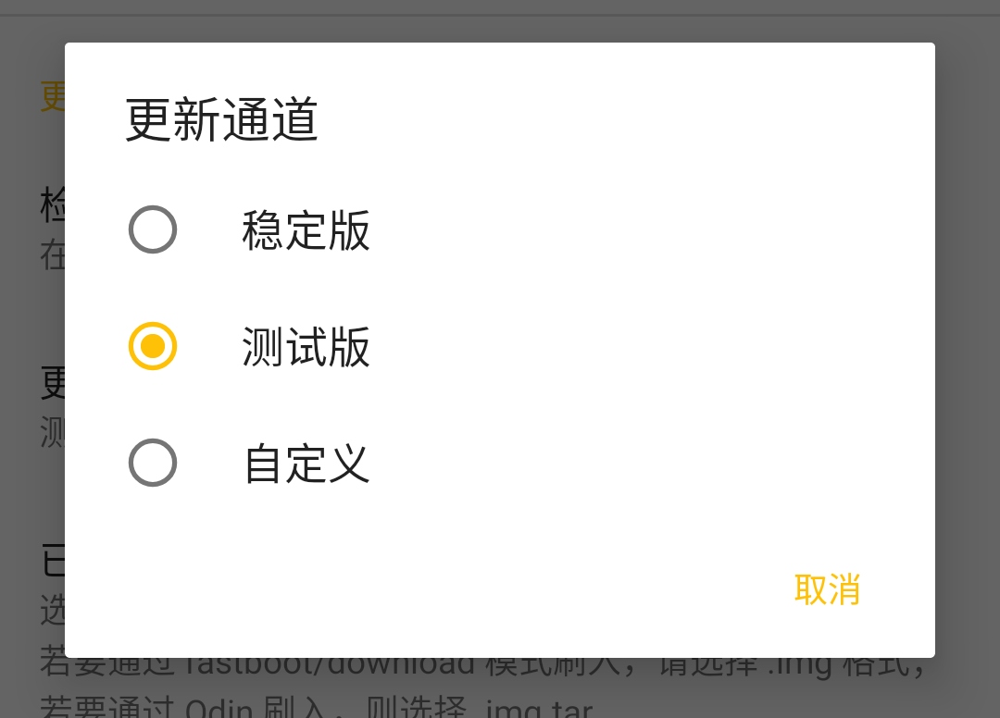
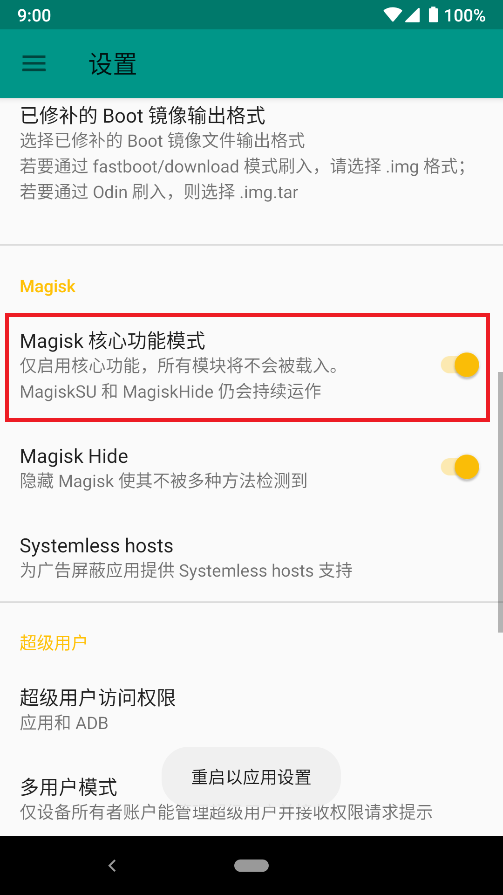
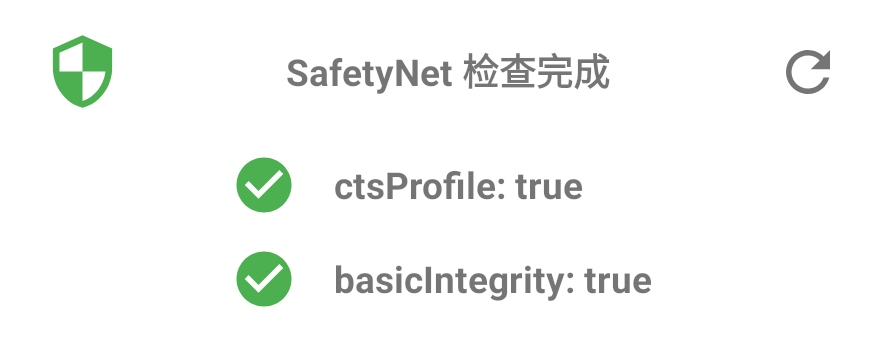
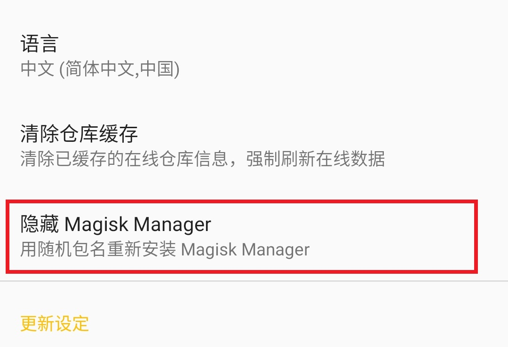

# 教程

## 安装 OTA
Magisk 不会实际修改 system 分区，这意味着可以方便地进行官方 OTA。这里提供了几个不同类型设备的教程，指导如何安装 OTA 并保留 Magisk（如果可能）。

**本教程仅适用于 Magisk v17.0 以上**

**注意：要进行OTA，必须确保从未以任何方式修改 `/system`（及 `/vendor` 如果存在）。即使仅仅将分区挂载为读写，也会破坏块验证!!**

### 准备工作
- 在开发者选项中关闭`系统自动更新`，这样如果没有用户确认，不会自动安装 OTA。

- 当 OTA 推送后, 转到（Magisk Manager → 卸载 → 还原原厂镜像）。 **不要重启，否则将卸载 Magisk。** 这会还原 Boot（和 dtbo 如果存在）恢复到 100% 原厂状态，以通过 OTA 前的块验证。 **在进行以下任何步骤前，必须完成此步！**

### A/B 分区的设备

由于这些设备有两个独立的分区，因此可以将 OTA 安装到未使用槽位，并让 Magisk 安装到更新后的分区上。OTA 将无缝工作，并在更新完成后保留 Magisk。

- 恢复原厂镜像后，像往常一样进行 OTA（设置 → 系统 → 系统更新）。
- 等待安装全部完成（ OTA 的步骤1和步骤2均完成），**不要按 “立即重启” 或 “重启” 按钮！** 相反，转到（Magisk Manager → 安装 → 安装到未使用的槽位）将 Magisk 安装到 OTA 引擎刚刚更新完毕的槽位中。

 

- 安装完成后，点按重启按钮。Magisk Manager 会强制把设备切换到更新的槽位，绕过任何 OTA 后的验证。

- 重启后，设备应该完成更新，最重要的是，Magisk 仍然安装在更新后的系统中！

### FlashFire 支持的设备
（如果正在使用 A/B 分区的设备，`强烈`建议使用上文方法进行更新。因为它是官方的 OTA 安装机制，并且在任何情况下都能使用）

Chainfire 开发的 [FlashFire](https://play.google.com/store/apps/details?id=eu.chainfire.flash) 能够安装 OTA 并且保留 Root。但是，它很可能不支持你的设备，并且 Chainfire 已不再维护此应用。

- 恢复原厂镜像后，下载 OTA（设置 → 系统 → 系统更新），**不要按重启进行安装**。
- 打开 FlashFire，它应该会检测到 OTA 更新包，在弹窗中选择“确定”完成设置。
- 参考截图进行设置。注意关闭 EverRoot（否则它将安装 SuperSU），在 OTA update.zip `之后`添加新动作 刷入 Magisk（update.zip 应该在上一步中自动设置完成）

- 按下底部 **Flash** 按钮, 几分钟后应该重启并更新完成。

### 传统的非 A/B 设备 - 一般情况
不幸的是，没有真正好的方法能够在这些设备上进行 OTA 并且保留 Magisk。你必须在升级后重新安装 Magisk，这将需要电脑。这是一般情况下的“最佳实践”。

- 要正确安装 OTA，需要原厂 Recovery。如果安装了自定义 Recovery，需要从备份或 OEM 提供的原厂镜像中找到原始 Recovery，使用 Root 刷回。
- 恢复原厂 Boot 和 Recovery 后，下载 OTA。 以下可选，当 OTA 更新包下载完成后，找到它并复制出来（因为此时设备没有重启，仍具有 Root）。这样就可以从 OTA 包中提取到此版本的原始 Boot 镜像和 Recovery 镜像，用于修补 Boot 或以后恢复 Recovery。
- 进行 OTA 更新。这将使用设备官方的 OTA 系统进行升级。
- 一旦完成，将获得升级后的系统，完全原厂，没有 Root。你必须重新安装 Magisk。

如果经常接收 OTA，建议不要修改 Recovery，可用使用以下方法安装 Magisk：
  - 如果支持，使用 `fastboot boot <recovery_img>` 启动到自定义 Recovery 并安装 Magisk。
  - 如果上文可选步骤保存了此版本的 Boot 镜像，可以通过 Magisk Manager 修补，然后使用 download 模式 / fastboot / Odin 等方法刷入。

## MagiskHide 最佳实践
很多人对为什么没有绕过检测感到疑惑，这是 MagiskHide 良好工作的最佳实践。以下指南是有序的，可能不必完成所有操作，但在继续下一步前，需要完成前面的所有步骤。

如果已经完成了所有步骤但仍未有效，请在设置中切换到测试通道，或安装你能得到的任何最新版本。可能有一些 MagiskHide 升级尚未推送到稳定通道。

设置 → 更新设置 → 更新通道

先从 SafetyNet 开始

- 在 Magisk Manager 中检查 SafetyNet 状态。 Google 已经禁止使用旧接口，很多 SafetyNet 检测应用从不更新，不会得到正确结果。**相信 Magisk Manager 的 SafetyNet 检测！**
- 从干净的地方开始： **使用原厂 ROM**。如果你更喜欢自定义系统，选择知名团队的稳定、官方版本。
- 如果不能通过 **basicIntegrity**，说明有严重的问题。尽管理论上 Magisk 模块能被 MagiskHide 隐藏，但还是应该开启 *核心功能模式* 看看是否有所变化。 如果依旧不能通过，说明 ROM 有问题。如果能够通过，排查模块。

- 如果**basicIntegrity**通过但**ctsProfile**没有。你可能正在使用未通过 CTS 测试的 ROM（OEM 测试版，预览版，国产 ROM 等). 尝试 @Didgeridoohan 的 [MagiskHide Props Config](https://forum.xda-developers.com/apps/magisk/module-magiskhide-props-config-t3789228) ，将系统指纹切换到已通过 CTS 测试的系统的指纹。

此时，SafetyNet 应该完全通过。接下来，处理各种应用自己的检测。

这真是令人赏心悦目，对吧？

- 将目标应用添加到 MagiskHide 列表：转到 Magisk Manager 的 MagiskHide 部分，勾选要隐藏的应用。**不要滥用 MagiskHide！** 有许多人添加了太多不必要的应用，这一定会增加耗电，很可能会破坏 Magisk 并容易导致系统出现异常。请记住：处理每一个隐藏的应用都需要很高的成本，仅添加确实需要的应用！
- 隐藏 Magisk Manager：转到（设置 → 隐藏 Magisk Manager）改变包名规避检测。

- 卸载敏感应用：处理 Magisk Manager 后，卸载 Xposed Installer、幸运破解器、其它 Root 管理应用等一切你认为可疑的应用。
- 删除敏感文件：自 Magisk Manager v5.9.0 起，不再使用`/sdcard/MagiskManager`。删除该文件夹（如果存在），然后删除内部存储空间中具有敏感名称（如 magisk、supersu、xposed）的任何文件或文件夹。是的，有应用会这样检测，并拒绝运行。
- 关闭 USB 调试（ADB）：位于开发者选项。
- 关闭开发者选项：注意，这会重置大多数开发者选项内的设置。
- 卸载 Magisk Manager：这应该是最后一步，可能有某些特征导致 Magisk Manager 被检出。如果卸载后能够通过，请及时向开发者报告。
